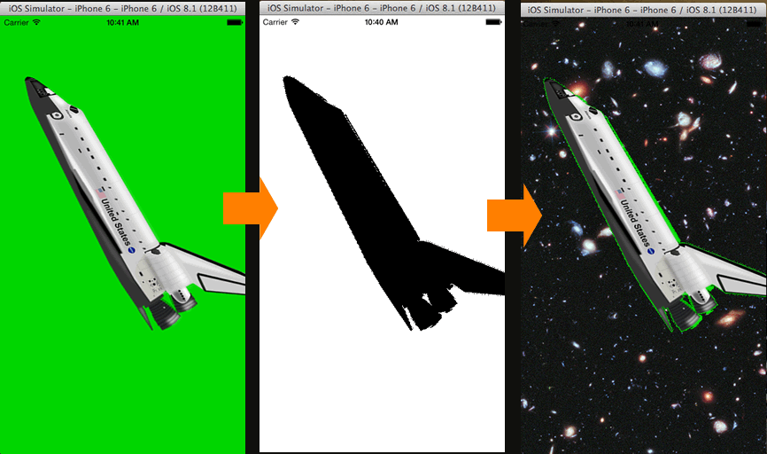

# PhotoChromakeyDemo

This is iOS original filter like chroma-key in Swift Language.

## Usage

git clone git@github.com:oggata/PhotoChromakeyDemo.git

1. Tap background-color you want to clip out
2. Inside, masking image (black & white) is created. 
3. Background-color is clipped by masking image.

## ToDo's

- Suggestions, issues and pull requests are more than welcome.

## Document
Qiita
http://qiita.com/oggata/items/aa7d4ecd9e1026fa970b

## Contact

Fumitoshi Ogata
- [twitter.com/oggata](http://twitter.com/oggata)
- oggata@gmail.com

## License
PhotoChromakeyDemo is available under the MIT license. 
See the LICENSE file for more info.